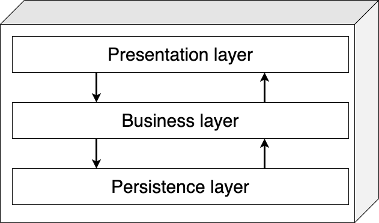

# 16-bits-zero-to-hero

### Build Status
<hr>

[](https://github.com/luizgustavocosta/16-bits-zero-to-hero/actions/workflows/node.js.yml)

[](https://github.com/luizgustavocosta/16-bits-zero-to-hero/actions/workflows/gradle.yml)

[](https://sonarcloud.io/summary/new_code?id=luizgustavocosta_16-bits-zero-to-hero)

### Project title
<hr>
🗒 Zero to hero 🚀 using React and SpringBoot

### Motivation
<hr>
Create a project with front-end and back-end to run easily locally or through the browser

### Solution
<hr>


### Database diagram


### Architecture 
#### Layered Architecture Style

The layered architecture, also known as the n-tiered architecture style, is one of the most common architecture styles. This style of architecture is the de facto standard for most applications, primarily because of its simplicity, familiarity, and low cost. It is also a very natural way to develop applications due to Conway’s law, which states that organizations that design systems are constrained to produce designs which are copies of the communication structures of these organizations. In most organizations there are user interface (UI) developers, backend developers, rules developers, and database experts (DBAs). These organizational layers fit nicely into the tiers of a traditional layered architecture, making it a natural choice for many business applications. The layered architecture style also falls into several architectural anti-patterns, including the architecture by implication anti-pattern and the accidental architecture anti-pattern. If a developer or architect is unsure which architecture style they are using, or if an Agile development team “just starts coding,” chances are good that it is the layered architecture style they are implementing. (Mark Richards, Neal Ford)



### Tech / Framework used


- JavaScript
- React 17.0.2
- MUI 5
- Jest
- GitHub actions


- Java 11
- SpringBoot 2.6.3
- Spring
- Hibernate
- Swagger - OpenAPI 1.6.7
- MapStruct
- JUnit 5
- GitHub actions

### Back-end code style
<hr>

[Java Code Conventions](https://www.oracle.com/java/technologies/javase/codeconventions-contents.html)

<hr>

### Installation
<hr>

### How to use it?
<hr>

#### Docker

`docker-compose up`

#### Locally
```
 cd back-end/zero2hero && ./gradlew bootRun
```
[Swagger documentation](http://127.0.0.1:8080/swagger-ui/index.html)

##### Disable security
#### Back-end

```
 cd back-end/zero2hero && ./gradlew bootRun
```

##### Endpoints
[Swagger documentation](http://127.0.0.1:8080/swagger-ui/index.html)


#### Front-end

```
cd front-end/ui-app && npm install && npm start
```

Open this [link](http://127.0.0.1:3000/) and use the Username and Password on the login screen

<kdb></kdb>

#### Gitpod

Steps

1. Clone the repo https://github.com/luizgustavocosta/16-bits-zero-to-hero
2. Open the [Gitpod](https://www.gitpod.io/), be sure you're logged in
3. Add the project hitting the button New Workspace
4. Open the terminal for the back-end
5. type ```cd back-end/zero2hero && ./gradlew bootRun```
6. Make the URL public
7. Back-end up and running  
8. Open the file ``application.json`` inside the UI project and update the value for ``SERVER_URL``. The server URL should be the back-end URL.
9. Type the command ``cd front-end/ui-app && npm install && npm start``
10. Voilà app up and running 

### References

- https://www.veryicon.com/
- https://spring-petclinic.github.io/
- https://github.com/in28minutes/spring-boot-react-fullstack-examples
- https://github.com/joelparkerhenderson/architecture-decision-record
- https://docs.sonarcloud.io/advanced-setup/automatic-analysis/
- https://github.com/zhangjunhd/reading-notes/blob/master/software/FundamentalsOfSoftwareArchitecture.md
- https://www.archunit.org/userguide/html/000_Index.html

### License
<hr>

+ [MIT](https://choosealicense.com/licenses/mit/)