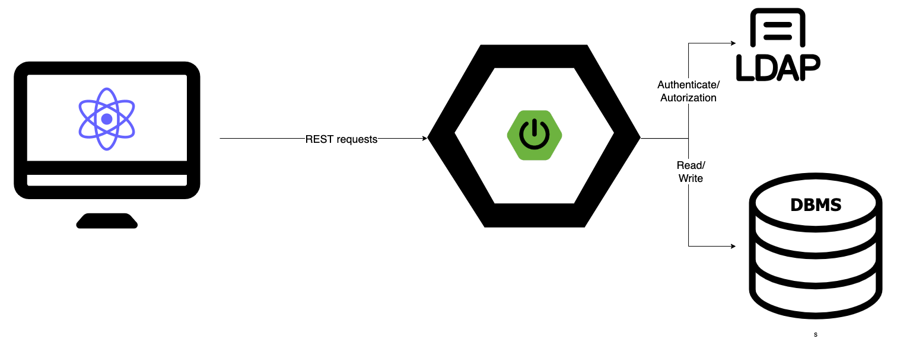
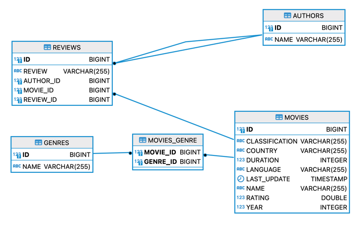
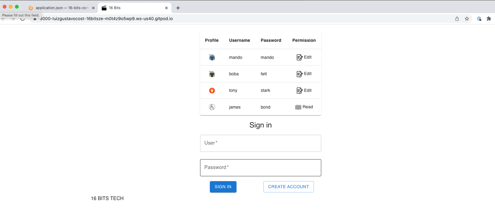

# 16-bits-zero-to-hero

### Build Status
<hr>

[](https://github.com/luizgustavocosta/16-bits-zero-to-hero/actions/workflows/node.js.yml)

[](https://github.com/luizgustavocosta/16-bits-zero-to-hero/actions/workflows/gradle.yml)

### Project title
<hr>
🗒 Zero to hero 🚀 using React and SpringBoot

### Motivation
<hr>
Create a project with front-end and back-end to run easily locally or through the browser

### Solution
<hr>



### Database diagram


### Tech / Framework used


- JavaScript
- React 17.0.2
- MUI 5
- Jest
- GitHub actions


- Java 11
- SpringBoot 2.6.3
- Spring
- Hibernate
- Swagger - OpenAPI 1.6.7
- MapStruct
- JUnit 5
- GitHub actions

### Back-end code style
<hr>

[Java Code Conventions](https://www.oracle.com/java/technologies/javase/codeconventions-contents.html)

<hr>

### Installation
<hr>

### How to use it?
<hr>

#### Locally
```
 cd back-end/zero2hero && ./gradlew bootRun
```
[Swagger documentation](http://localhost:8080/swagger-ui/index.html)

##### Disable security
#### Back-end

```
 cd back-end/zero2hero && ./gradlew bootRun
```

##### Endpoints
[Swagger documentation](http://localhost:8080/swagger-ui/index.html)


#### Front-end

```
cd front-end/ui-app && npm install && npm start
```

Open this [link](http://localhost:3000/) and use the Username and Password on the login screen

<kdb></kdb>

#### Gitpod

Steps

1. Clone the repo https://github.com/luizgustavocosta/16-bits-zero-to-hero
2. Open the [Gitpod](https://www.gitpod.io/), be sure you're logged in
3. Add the project hitting the button New Workspace
4. Open the terminal for the back-end
5. type ```cd back-end/zero2hero && ./gradlew bootRun```
6. Make the URL public
7. Back-end up and running  
8. Open the file ``application.json`` inside the UI project and update the value for ``SERVER_URL``. The server URL should be the back-end URL.
9. Type the command ``cd front-end/ui-app && npm install && npm start``
10. Voilá app up and running 

### References

- https://www.veryicon.com/
- https://spring-petclinic.github.io/
- https://github.com/in28minutes/spring-boot-react-fullstack-examples
- https://github.com/joelparkerhenderson/architecture-decision-record

### License
<hr>

+ [MIT](https://choosealicense.com/licenses/mit/)